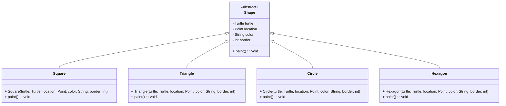

```mermaid

classDiagram
    class Shape {
        <<abstract>>
        - Turtle turtle
        - Point location
        - String color
        - int border
        + paint(): void
    }

    class Square {
        + Square(turtle: Turtle, location: Point, color: String, border: int)
        + paint(): void
    }

    class Triangle {
        + Triangle(turtle: Turtle, location: Point, color: String, border: int)
        + paint(): void
    }

    class Circle {
        + Circle(turtle: Turtle, location: Point, color: String, border: int)
        + paint(): void
    }

    class Hexagon {
        + Hexagon(turtle: Turtle, location: Point, color: String, border: int)
        + paint(): void
    }

    Shape <|-- Square
    Shape <|-- Triangle
    Shape <|-- Circle
    Shape <|-- Hexagon
```